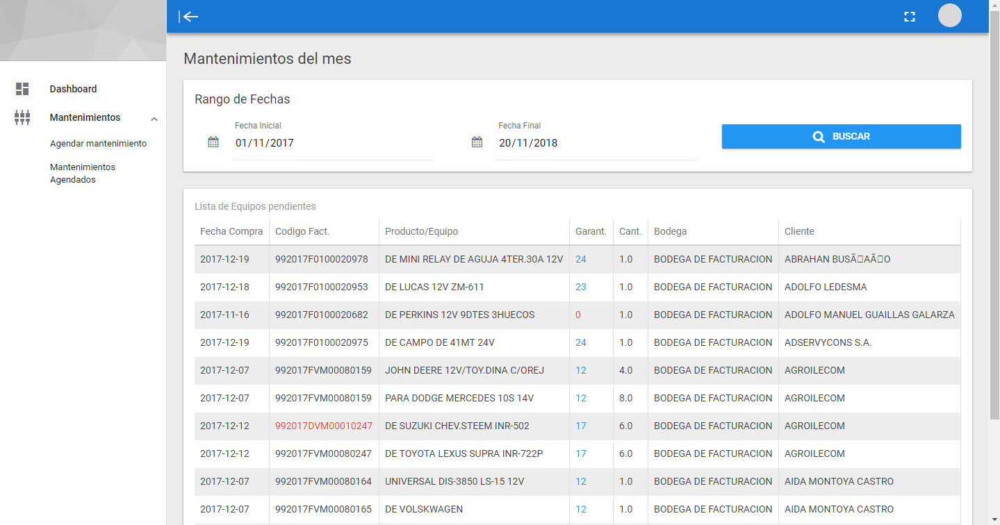

### Current Version : v1.30

## SQL SERVER REQUERIMIENTOS:
- Accesa a la carpeta SQL e importe los esquemas de las tablas y procedimientos almacenados necesarios.
- Configure el acceso a la db en la clase conexion de la carpeta models.

## Supported Browsers:
Chrome 35+, Firefox 31+, Safari 7+, IE 10+

## Quickstart:
- Descomprimir o clonar proyecto en directorio de servidor apache con php 5.5 o superior.
- Cargar el archivo SQL para generar las tablas y evitar errores de conexion.
- Editar las credenciales de conexion a la DB en el archivo .\core\models\conexion.php 
- Revisar ruta del directorio de carga de documentos PDF y XML por defecto son docwf/pdf y docwf/xml (el directorio para la carga FTP de los archivos debe estar fuera del directorio del proyecto)
-

## Changelog

